# Network Anomaly detection on datasets NSL-KDD, Kyoto University and Mawii labs

This project has been conducted under the supervision of Dr. Jinoh Kim  and Dr. Donghwoon Kwon  at Texas A&M University-Commerce. The research outcome will be published in the proceeding of [IEEE ICNC 2018](http://www.conf-icnc.org/2018/), with the title of “An Empirical Evaluation of Deep Learning for Network Anomaly Detection”.

* *Below results are for NSL-KDD Dataset only. Master branch contains code for NSL-KDD dataset. There are separate dev branches for Kyoto University and Mawii labs. The networks implemented are same for all datasets.*

# Exploratory Data Analysis
### Andrew Curves (High dimensional data plots)

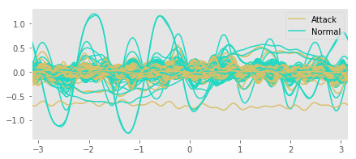

### T-SNE (Data dimensionality Reduction)
#### Pattern evolving during epochs
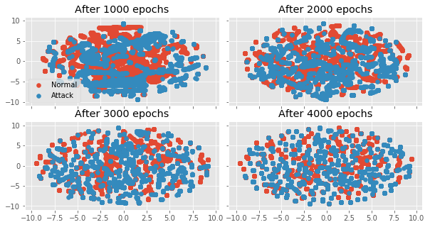

#### Pattern in final (4000) epoch
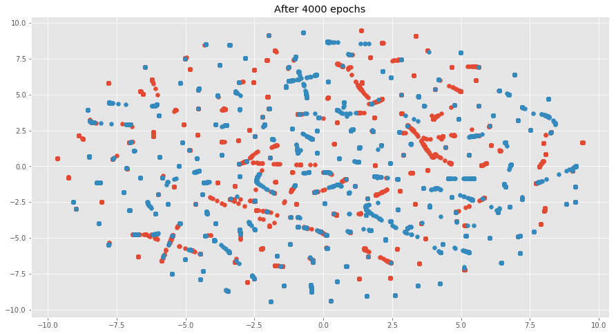

# Results of Train/Test cylces

## Fully Connected Neural Network

<table border="1" class="dataframe">
  <thead>
    <tr style="text-align: right;">
      <th></th>
      <th></th>
      <th></th>
      <th>Accuracy</th>
      <th>F1 Score</th>
      <th>Precision</th>
      <th>Recall</th>
    </tr>
    <tr>
      <th>Model</th>
      <th>Scenarios</th>
      <th>Number of Features</th>
      <th></th>
      <th></th>
      <th></th>
      <th></th>
    </tr>
  </thead>
  <tbody>
    <tr>
      <th rowspan="4" valign="top">Fully Connected</th>
      <th>Train+_Test+</th>
      <th>48</th>
      <td>0.8670</td>
      <td>0.8739</td>
      <td>0.9490</td>
      <td>0.8098</td>
    </tr>
    <tr>
      <th>Train+_Test-</th>
      <th>48</th>
      <td>0.7576</td>
      <td>0.8350</td>
      <td>0.9424</td>
      <td>0.7495</td>
    </tr>
    <tr>
      <th>Train-_Test+</th>
      <th>48</th>
      <td>0.8561</td>
      <td>0.8695</td>
      <td>0.8988</td>
      <td>0.8420</td>
    </tr>
    <tr>
      <th>Train-_Test-</th>
      <th>48</th>
      <td>0.7504</td>
      <td>0.8396</td>
      <td>0.8856</td>
      <td>0.7981</td>
    </tr>
  </tbody>
</table>

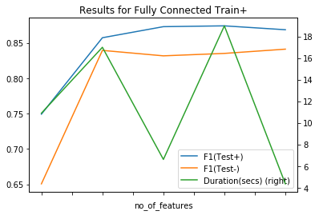

## Variational Autoencoder
### latent variables used for prediction

<table border="1" class="dataframe">
  <thead>
    <tr style="text-align: right;">
      <th></th>
      <th></th>
      <th></th>
      <th>Accuracy</th>
      <th>F1 Score</th>
      <th>Precision</th>
      <th>Recall</th>
    </tr>
    <tr>
      <th>Model</th>
      <th>Scenarios</th>
      <th>Number of Features</th>
      <th></th>
      <th></th>
      <th></th>
      <th></th>
    </tr>
  </thead>
  <tbody>
    <tr>
      <th rowspan="4" valign="top">VAE-Softmax</th>
      <th>Train+_Test+</th>
      <th>122</th>
      <td>0.8948</td>
      <td>0.9036</td>
      <td>0.9441</td>
      <td>0.8665</td>
    </tr>
    <tr>
      <th>Train+_Test-</th>
      <th>122</th>
      <td>0.8173</td>
      <td>0.8814</td>
      <td>0.9402</td>
      <td>0.8296</td>
    </tr>
    <tr>
      <th>Train-_Test+</th>
      <th>48</th>
      <td>0.7195</td>
      <td>0.6942</td>
      <td>0.9151</td>
      <td>0.5592</td>
    </tr>
    <tr>
      <th>Train-_Test-</th>
      <th>48</th>
      <td>0.8015</td>
      <td>0.8700</td>
      <td>0.9373</td>
      <td>0.8118</td>
    </tr>
  </tbody>
</table>

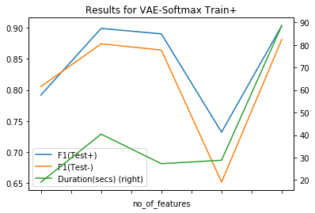

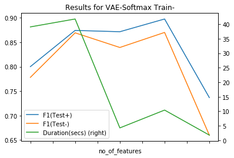

## Variational Autoencoder
### Anomaly labels treated as part of actual data 
Network learns to regenerated labels treating it as missing data during testing.

<table border="1" class="dataframe">
  <thead>
    <tr style="text-align: right;">
      <th></th>
      <th></th>
      <th></th>
      <th>Accuracy</th>
      <th>F1 Score</th>
      <th>Precision</th>
      <th>Recall</th>
    </tr>
    <tr>
      <th>Model</th>
      <th>Scenarios</th>
      <th>Number of Features</th>
      <th></th>
      <th></th>
      <th></th>
      <th></th>
    </tr>
  </thead>
  <tbody>
    <tr>
      <th rowspan="4" valign="top">VAE-GenerateLabels</th>
      <th>Train+_Test+</th>
      <th>1</th>
      <td>0.5692</td>
      <td>0.7255</td>
      <td>0.5692</td>
      <td>1.0</td>
    </tr>
    <tr>
      <th>Train+_Test-</th>
      <th>1</th>
      <td>0.8184</td>
      <td>0.9001</td>
      <td>0.8184</td>
      <td>1.0</td>
    </tr>
    <tr>
      <th>Train-_Test+</th>
      <th>1</th>
      <td>0.5692</td>
      <td>0.7255</td>
      <td>0.5692</td>
      <td>1.0</td>
    </tr>
    <tr>
      <th>Train-_Test-</th>
      <th>1</th>
      <td>0.8184</td>
      <td>0.9001</td>
      <td>0.8184</td>
      <td>1.0</td>
    </tr>
  </tbody>
</table>

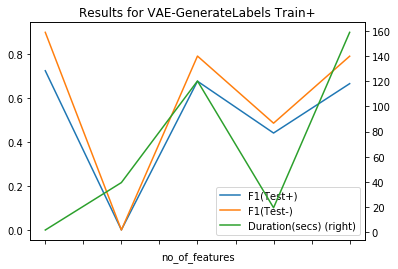

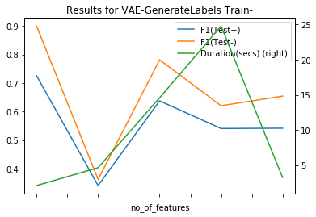

## LSTM Seq2Seq
Softmax layer is used to convert output sequence to Normal/Anomaly prediction.

<table border="1" class="dataframe">
  <thead>
    <tr style="text-align: right;">
      <th></th>
      <th></th>
      <th></th>
      <th>Accuracy</th>
      <th>F1 Score</th>
      <th>Precision</th>
      <th>Recall</th>
    </tr>
    <tr>
      <th>Model</th>
      <th>Scenarios</th>
      <th>Number of Features</th>
      <th></th>
      <th></th>
      <th></th>
      <th></th>
    </tr>
  </thead>
  <tbody>
    <tr>
      <th rowspan="4" valign="top">LSTM Seq2Seq</th>
      <th>Train+_Test+</th>
      <th>1</th>
      <td>0.9949</td>
      <td>0.9955</td>
      <td>0.9915</td>
      <td>0.9995</td>
    </tr>
    <tr>
      <th>Train+_Test-</th>
      <th>1</th>
      <td>0.9949</td>
      <td>0.9955</td>
      <td>0.9915</td>
      <td>0.9995</td>
    </tr>
    <tr>
      <th>Train-_Test+</th>
      <th>1</th>
      <td>0.9992</td>
      <td>0.9993</td>
      <td>0.9985</td>
      <td>1.0000</td>
    </tr>
    <tr>
      <th>Train-_Test-</th>
      <th>1</th>
      <td>0.9992</td>
      <td>0.9993</td>
      <td>0.9985</td>
      <td>1.0000</td>
    </tr>
  </tbody>
</table>

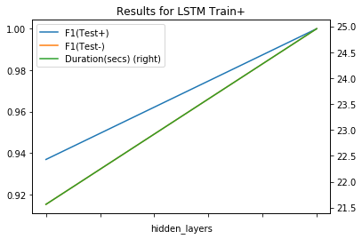

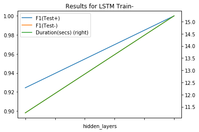

# Conclusion

<table border="1" class="dataframe">
  <thead>
    <tr style="text-align: right;">
      <th>Model</th>
      <th>Fully Connected</th>
      <th>LSTM</th>
      <th>VAE-GenerateLabels</th>
      <th>VAE-Softmax</th>
    </tr>
    <tr>
      <th>Scenarios</th>
      <th></th>
      <th></th>
      <th></th>
      <th></th>
    </tr>
  </thead>
  <tbody>
    <tr>
      <th>Train+_Test+</th>
      <td>0.8739</td>
      <td>0.9955</td>
      <td>0.7255</td>
      <td>0.9036</td>
    </tr>
    <tr>
      <th>Train+_Test-</th>
      <td>0.8350</td>
      <td>0.9955</td>
      <td>0.9001</td>
      <td>0.8814</td>
    </tr>
    <tr>
      <th>Train-_Test+</th>
      <td>0.8695</td>
      <td>0.9993</td>
      <td>0.7255</td>
      <td>0.6942</td>
    </tr>
    <tr>
      <th>Train-_Test-</th>
      <td>0.8396</td>
      <td>0.9993</td>
      <td>0.9001</td>
      <td>0.8700</td>
    </tr>
  </tbody>
</table>

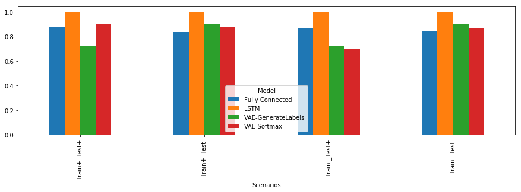

<table border="1" class="dataframe">
  <thead>
    <tr style="text-align: right;">
      <th>Scenarios</th>
      <th>Train+_Test+</th>
      <th>Train+_Test-</th>
      <th>Train-_Test+</th>
      <th>Train-_Test-</th>
    </tr>
    <tr>
      <th>Model</th>
      <th></th>
      <th></th>
      <th></th>
      <th></th>
    </tr>
  </thead>
  <tbody>
    <tr>
      <th>Fully Connected</th>
      <td>0.8739</td>
      <td>0.8350</td>
      <td>0.8695</td>
      <td>0.8396</td>
    </tr>
    <tr>
      <th>LSTM</th>
      <td>0.9955</td>
      <td>0.9955</td>
      <td>0.9993</td>
      <td>0.9993</td>
    </tr>
    <tr>
      <th>VAE-GenerateLabels</th>
      <td>0.7255</td>
      <td>0.9001</td>
      <td>0.7255</td>
      <td>0.9001</td>
    </tr>
    <tr>
      <th>VAE-Softmax</th>
      <td>0.9036</td>
      <td>0.8814</td>
      <td>0.6942</td>
      <td>0.8700</td>
    </tr>
  </tbody>
</table>

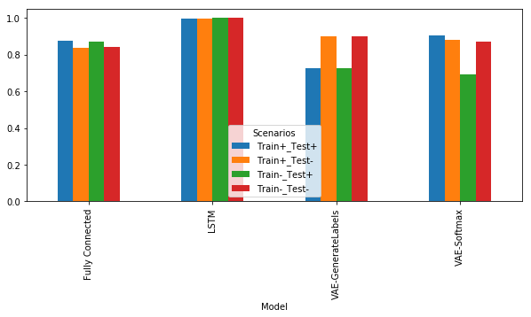

